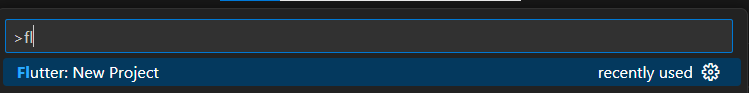

# Flutter Task1 Дементьев Егор Павлович ЭФБО-01-22

## Установка

1. Установил Flutter SDK с официального сайта и прописал путь в переменных среды
2. Установил расширения для VSCode (Не Android Studio тк среда запрещает установку согласно законодательству)

## Создание проекта

1. Создал новый проект в VSCode 

2. Отредактировал main.dart для отображения ФИО и группы

3. Проверил работу созданного приложения через эмулятор
